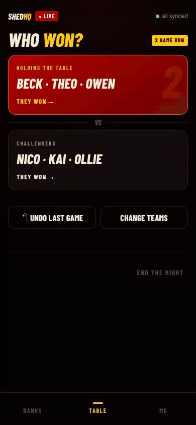
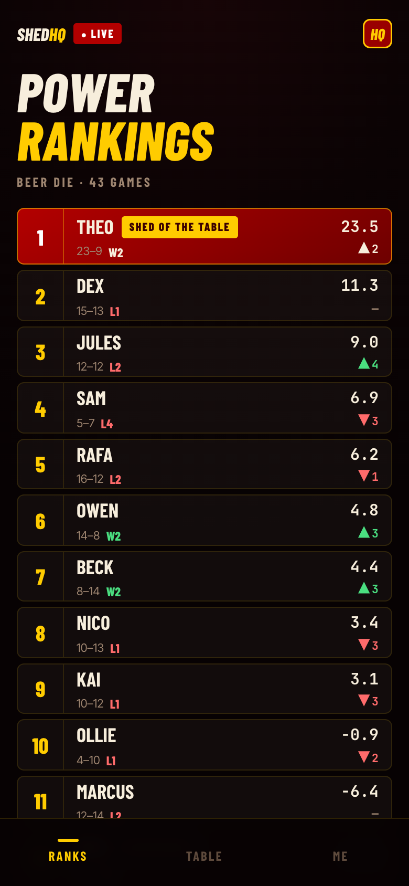
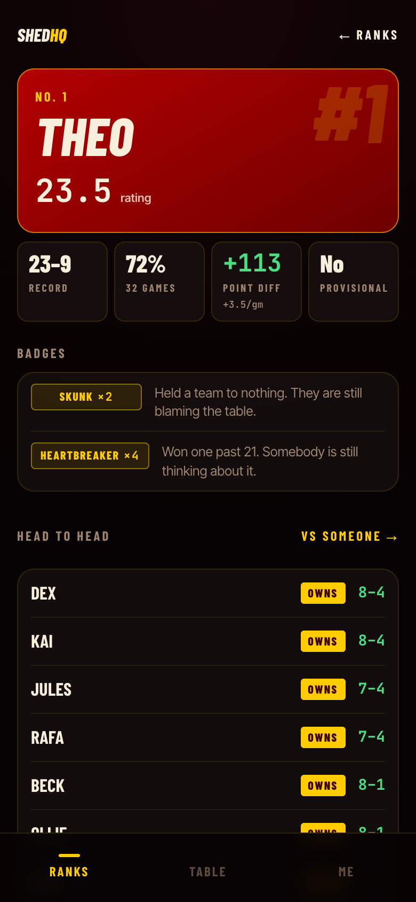
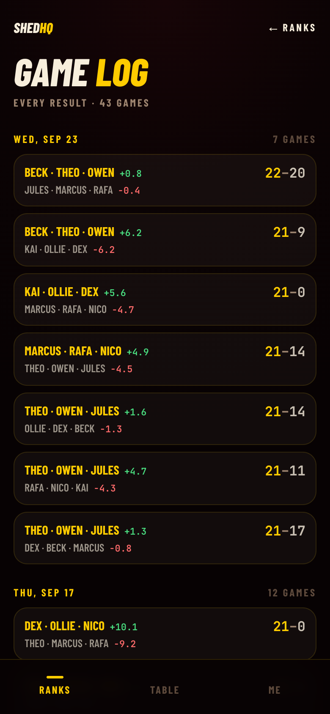
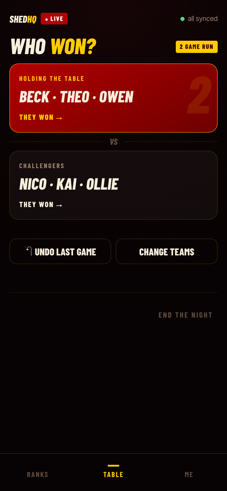

# Shedquarters

[](https://github.com/llukehanna/Shedquarters/actions/workflows/ci.yml)

A skill-rating ladder for a house league, scored from a phone at the table and live at [shed.lukeghanna.com](https://shed.lukeghanna.com).

The games are beer die (2v2 or 3v3, first to 21) and spikeball (2v2, first to 25, 15 or 11, picked game by game). Both are win by 2, the winners stay on, and each has its own ladder.
Someone at the table taps who won and what the losers finished on. Everyone else's phone shows the rankings, a game log, head-to-heads, and badges.
Ratings are [OpenSkill](https://github.com/philihp/openskill.js), replayed from the full game history on every change.

<p align="center">
  
</p>

<sub>Recorded from the real app against a local database of made-up players. [MP4](docs/media/demo.mp4)</sub>

## What makes it interesting

**Built for bad party wifi.**
Every game is written to a queue in `localStorage` first and shown immediately, then flushed to the server in order.
Each game carries a client-generated id and the write path is idempotent on it, so a retry after an ambiguous failure can't record a game twice.
The queue tells a *transient* failure (Neon cold start, dropped connection: keep it and retry) from a *permanent* one (a malformed or refused game: set it aside and say so), because retrying a permanent failure forever blocks every game behind it.
The server maps errors to status codes with an explicit allowlist, so anything unexpected is a retryable 500 by default. A stuck queue can be recovered. A discarded game can't.

**Ratings are a pure function of history.**
The `games` table is append-only apart from a `voided` flag.
Ratings, per-game rating changes, rank movement, streaks and badges are all derived by replaying it in order.
An undo is just a void, a tuning change is just a replay, and there is no stored rating that can drift out of sync with the games it came from.
The replay is cached against a fingerprint of the table (`count : max(ord) : voided count`), which only ever grows, so a stale cache is always detected and rebuilt.

**Margin of victory counts, but only past a point.**
OpenSkill's margin option means a 21–4 blowout moves ratings more than a 21–19 scrape. Anything within 5 points is an ordinary win; past that the extra weight grows logarithmically, so a skunk counts for more without dominating a season.
New players are marked provisional until 10 games, and the rankings mark them that way instead of hiding them.

**A four-digit PIN that stays safe on the open internet.**
The house wanted a PIN, not accounts. With only 10,000 possibilities, the design limits guessing to one place and makes it slow.
The PIN is checked only at `/gate`, which is rate limited in Postgres (serverless instances share no memory) under a transaction-scoped advisory lock, so 100 parallel guesses can't all read "zero failures".
A global cap of 20 wrong guesses a day works out to about 250 days to find the PIN on average.
The session cookie holds an HMAC signature, never the PIN, so hammering the write API with `Cookie: house=0000…9999` gets 10,000 `401`s and learns nothing.
Changing the PIN or resetting the invite link signs out every device at once. The PIN's hash and the invite version are both inside every signature.

**Winner-stays-on is modeled directly.**
Only the challengers change between games, so logging one is: tap the winners, tap the losing score, pick who's up next.
The table state (who holds it, who's challenging, the current run) updates in the same transaction as the game row, so they can't disagree even when a retry lands mid-write.

More in [docs/ARCHITECTURE.md](docs/ARCHITECTURE.md), [docs/OFFLINE.md](docs/OFFLINE.md), [docs/RATINGS.md](docs/RATINGS.md), and [docs/ACCESS.md](docs/ACCESS.md).

## Screens

<p align="center">
  
  
  
  
</p>

Rankings with weekly movement and a "Shed of shame" · player pages with badges and head-to-head records · a game log with each game's rating change · table mode for the scorekeeper.
It installs to the home screen as a web app and has its own offline screen.

## Stack

- **Next.js 16** (App Router, server components, server actions) + **React 19** + **TypeScript**
- **Postgres** via `postgres.js`: Neon in production, Docker locally
- **OpenSkill** (Plackett–Luce) for ratings
- **Tailwind CSS 4**, **Motion** for animation
- **Vercel**: Fluid Compute, a nightly Cron backup to Vercel Blob
- **Vitest**: 611 tests, most of them against a real Postgres; GitHub Actions CI

## Running locally

Requires Node 20.12+ and Docker.

```bash
docker run -d --name houseladder-pg \
  -e POSTGRES_PASSWORD=houseladder -e POSTGRES_USER=houseladder -e POSTGRES_DB=houseladder \
  -p 55432:5432 postgres:17-alpine

npm install
cp .env.example .env.local
npm run migrate          # creates the schema, prints the table list
npm run dev              # http://localhost:3000
```

Checks:

```bash
npx next build           # first: it generates the route types tsc needs
npx tsc --noEmit
npx eslint
npm test                 # 611 tests across 41 files
npm run smoke            # a full session against the local DB: start, log, undo, replay, end
```

Tests and scripts that delete rows call `assertLocalDatabase()` first and refuse to run unless `DATABASE_URL` points at localhost.
`npm test` reads `.env.local`, and pointed at production it would wipe real game history.

Deploying, environment variables, lockout recovery and the post-deploy smoke check are in [docs/OPERATIONS.md](docs/OPERATIONS.md).

## Repo layout

```
lib/domain/      pure logic: scoring, table transitions, the rating replay, stats, badges, lineups
lib/client/      the offline write queue and persisted UI state (browser only)
lib/             session state machine, queries, ratings cache, auth, gate, backup
app/(tabs)/      rankings, player pages, game log, head-to-head, table mode, roster
app/api/         POST /api/games (the only game write path) and the nightly backup cron
components/      table mode, lineup editor, PIN keypad, UI primitives
tests/           unit tests for lib/domain, integration tests against Postgres
docs/            ARCHITECTURE, OFFLINE, RATINGS, ACCESS, DATABASE, OPERATIONS
```

`lib/domain` imports nothing from the database or React, so every rule the app enforces can be tested without either.

## Things that went wrong

Each of these made it into code or was caught in review, and each changed how the app is built:

- **Parallel queue flushes evicted unsent games.** The table drains the queue on load, on reconnect, on a 15-second timer, and after every game, so overlapping drains were routine. Two drains would each send the same first game and each remove *one* item, deleting a game that was never sent. Drains are now serialized behind one in-flight promise.
- **A rejected write stranded the table permanently.** `logGame` originally inserted the game, then validated, then updated the table state. A rejected write followed by a retry with the same client id hit the idempotency check and skipped the table update forever. Since the offline queue always retries with the same id, this was certain to happen. Validation now runs first, and the insert and update share one transaction.
- **The first cookie held the PIN.** Anyone could skip the rate-limited gate by sending `Cookie: house=1234` straight to the write endpoint, 10,000 times. The cookie is now a signed token, and the PIN is compared in exactly one place.
- **A missing secret opened the backup endpoint.** `if (secret && …)` meant an unset `CRON_SECRET` skipped the auth check and served the full database dump to anyone. It now fails closed: no secret, no database work.
- **A cookie format change signed out every phone mid-game.** A housemate got a raw React error in the middle of a game. Token formats now carry a version tag with a compatibility window, and a test pins that old tags still read.
- **Every cache hit crashed the player page.** The ratings cache bound `JSON.stringify(ratings)` as a string and cast it to `jsonb`, storing JSON inside JSON. Misses worked, hits didn't. Found by checking `jsonb_typeof(payload)`.

## Status

- Live and in use at [shed.lukeghanna.com](https://shed.lukeghanna.com). The rankings, game log and player pages are public; changing anything needs the house PIN or invite link
- 611 tests across 41 files; build, typecheck, lint and tests run in CI against Postgres 17
- One shared PIN, no per-person accounts, by design. A phone claims a player with "Who are you?", which is identity, not authentication
- Beer die (2v2 and 3v3) and spikeball (2v2) only, each rated separately. No rating decay for inactive players yet (a "Ghost" badge marks them instead)
- Known gaps and cleanup are tracked in [docs/FOLLOWUPS.md](docs/FOLLOWUPS.md)

## License

[MIT](LICENSE)
